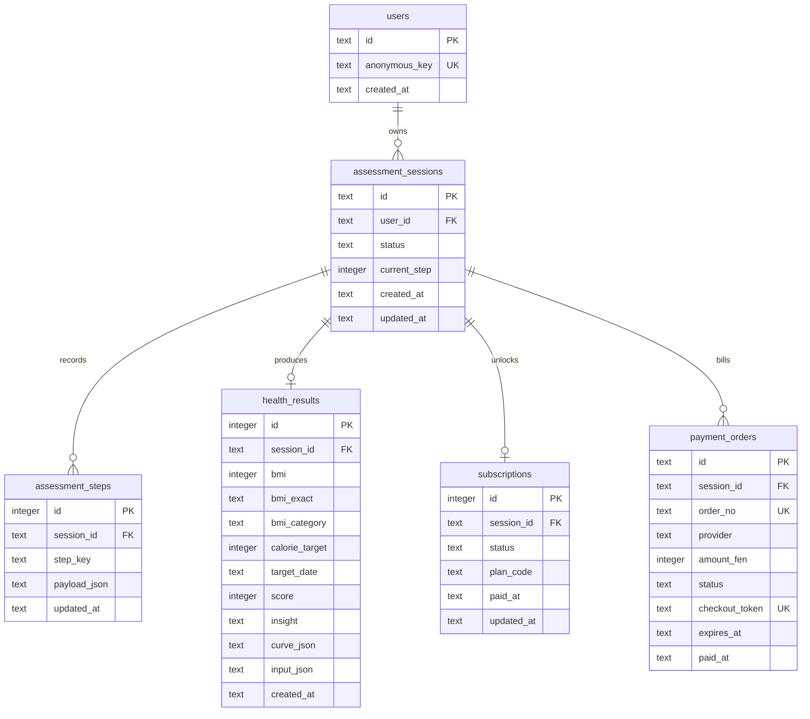

# pulse/08 · 健康信号地图

一个中文健康测评 Funnel 的全栈实现：用户逐步填写个人目标与身体数据，服务端计算 BMI、建议摄入量和目标日期；中途刷新可恢复进度，结果页先展示脱敏预览，再通过“二维码下单 → 模拟收银台确认 → 回调解锁”查看完整趋势。

## 产品设计

参考 BetterMe 的“全屏单步选择 + 顶部进度 + 结果解锁”节奏，但做了三处改造：

- 每一步都有即时“实时计划预览”，用户能理解为什么继续填写。
- 结果页展示健康信号、可解释洞察和目标窗口，而不是只给一个分数；完整结果还会拆成四阶段行动路线、每周检查点和状态调整规则。
- 不强制注册或填写邮箱，匿名 HttpOnly session 负责恢复进度；付款是可重放的演示回调。

## 交付物导航

- [交付物完成度清单](./docs/DELIVERY-CHECKLIST.md)
- [主交付文档](./docs/DELIVERY.md)
- [API 完整参考](./docs/API.md)
- [自动化测试与 CI](./docs/TESTING.md)
- [数据库 Schema 与 Mermaid ER 图](./docs/DATABASE-SCHEMA.md)
- [AI 使用复盘](./docs/AI-RETROSPECTIVE.md)

## 需求完成度

除公网部署相关交付物外，挑战要求的本地工程闭环已经完成：

| 要求 | 状态 | 证据 |
| --- | --- | --- |
| 分步保存与中断恢复 | 已完成 | Cookie 会话、步骤表事实来源、D1 HTTP smoke |
| 服务端健康计算 | 已完成 | BMI、能量目标、目标日期、趋势与行动路线 |
| 订阅鉴权与差异化结果 | 已完成 | preview/full、脱敏导出、二维码订单与幂等模拟回调 |
| 非法输入与边界测试 | 已完成 | Zod 上下界、未知字段、非法 JSON、支付参数校验 |
| 并发与状态一致性 | 已完成 | `Promise.all` 并发保存、完成态写保护、结果幂等 |
| 自动化质量保障 | 已完成 | Vitest、TypeScript、lint、生产构建、D1 smoke、CI |
| 数据模型与 Schema 图 | 已完成 | `db/schema.ts`、Drizzle migration、Mermaid ER 图 |
| AI 使用复盘 | 已完成 | [独立复盘文档](./docs/AI-RETROSPECTIVE.md) |
| 公网 URL、GitHub 链接、线上 sessionId | 待上线 | 按当前阶段暂不处理 |

## 技术栈

- Next.js App Router + Vinext + TypeScript
- Cloudflare Worker 兼容运行时
- Drizzle ORM + SQLite/D1
- Zod 服务端校验
- Vitest 自动化测试
- 原生 WebMCP 工具：读取进度、保存步骤、完成测评、解锁结果

## 启动

环境要求：Node.js `>=22.13.0`。

```bash
npm install
npm run db:generate   # schema 变化时生成新的 Drizzle migration
npm run build
npm start
```

本地 D1 首次使用时执行：

```bash
npm run db:local:seed
```

开发预览也可以用 `npm run dev`；完整 API 验证建议使用 `npm start`，因为它会通过 Wrangler 启动带 D1 的 Worker。

## API

除“创建新测评”的 `POST /api/assessment/reset` 外，所有写接口和结果接口都通过 `pulse_session` HttpOnly Cookie 绑定当前测评会话。完整请求、响应和错误契约见 [API 完整参考](./docs/API.md)。

| 方法 | 路径 | 作用 |
| --- | --- | --- |
| GET | `/api/assessment` | 创建或恢复当前 session |
| POST | `/api/assessment/reset` | 创建全新的测评 session，旧结果保留但不再复用 |
| PATCH | `/api/assessment` | 保存一个步骤，支持乱序和重复提交 |
| POST | `/api/assessment/complete` | 服务端校验完整数据并生成结果 |
| GET | `/api/results` | 会员返回完整数据，非会员只返回 summary 和 `protected.totalWeeks/message`，不返回 `details/curve` |
| GET | `/api/results/export` | 下载当前会话可见范围内的 Markdown 报告 |
| POST | `/api/pay` | 创建 15 分钟有效的 `wechat_mock` 待支付订单并返回扫码地址 |
| GET | `/api/pay?orderId=<uuid>` | 桌面端查询当前订单状态，不返回扫码 token |
| GET/POST | `/api/pay/mock` | 模拟收银台读取/确认短时扫码 token；确认后订阅变为 active |

接口约束：除 reset 和携带扫码 token 的模拟收银台外，没有 `pulse_session` Cookie 的写入/结果请求返回 `401`；非法步骤返回 `400`；非法 JSON 返回 `400`；PATCH 顶层或步骤数据包含未声明字段时返回 `422`；Zod 数据校验失败返回 `422`；已完成 session 不允许继续修改，返回 `409`，需要通过 reset 开始新测评。

### 可重放的 `/pay` 流程

下面的命令会生成一个新的 session。把 `BASE` 改成线上 URL 即可在线演示；`-c/-b` 用来保存和复用会话 Cookie。

```bash
BASE=http://127.0.0.1:8787

curl -sS -c pulse.cookies "$BASE/api/assessment"
curl -sS -b pulse.cookies -H 'Content-Type: application/json' -X PATCH \
  -d '{"step":"identity","data":{"gender":"woman"}}' "$BASE/api/assessment"
curl -sS -b pulse.cookies -H 'Content-Type: application/json' -X PATCH \
  -d '{"step":"goal","data":{"goal":"feel_lighter"}}' "$BASE/api/assessment"
curl -sS -b pulse.cookies -H 'Content-Type: application/json' -X PATCH \
  -d '{"step":"activity","data":{"activityLevel":"steady","exerciseDays":3}}' "$BASE/api/assessment"
curl -sS -b pulse.cookies -H 'Content-Type: application/json' -X PATCH \
  -d '{"step":"body","data":{"age":32,"heightCm":168,"weightKg":76}}' "$BASE/api/assessment"
curl -sS -b pulse.cookies -H 'Content-Type: application/json' -X PATCH \
  -d '{"step":"target","data":{"targetWeightKg":68}}' "$BASE/api/assessment"

# 付款前：access=preview，响应中不包含 details 或 curve
curl -sS -b pulse.cookies -H 'Content-Type: application/json' -X POST \
  -d '{}' "$BASE/api/assessment/complete"
curl -sS -b pulse.cookies "$BASE/api/results"

# 创建模拟支付订单：状态为 pending，响应中的 checkoutUrl 可用于生成二维码
curl -sS -b pulse.cookies -H 'Content-Type: application/json' -X POST \
  -d '{"plan":"pulse_weekly"}' "$BASE/api/pay"

# 从 checkoutUrl 中取出 token；扫码页和该 cURL 都只模拟回调，不会真实转账
curl -sS "$BASE/api/pay/mock?token=<checkout-token>"
curl -sS -H 'Content-Type: application/json' -X POST \
  -d '{"checkoutToken":"<checkout-token>"}' "$BASE/api/pay/mock"

# 模拟回调后：subscriptionStatus=active，响应中出现完整 details.curve、actionPlan 和 phasePlan
curl -sS -b pulse.cookies "$BASE/api/results"
curl -sS -b pulse.cookies -OJ "$BASE/api/results/export"
```

线上验收时，首次 `GET /api/assessment` 的响应会给出 `session.id`；完成上述流程后，这个值就是可对比的已支付测试 `sessionId`。

## 数据模型

完整字段职责和 Mermaid ER 图见：[数据库 Schema 文档](./docs/DATABASE-SCHEMA.md)。



- `assessment_steps` 以 `(session_id, step_key)` 唯一约束保存增量数据，是进度恢复和并发更新的事实来源。
- `assessment_sessions.current_step` 只做快速展示，使用 `max(current_step, incoming_step)`，不会因乱序提交倒退。
- `health_results` 保存服务器计算结果、输入快照和趋势 JSON，`subscriptions` 独立记录权限状态，`payment_orders` 保留 pending/paid/expired 的支付状态机和过期时间。
- 数据库在应用校验之外增加状态、步骤、金额和方案的 CHECK 约束；每个 session 同一时间最多存在一个 pending 订单。
- 会员报告额外返回按第 1 周、中段和目标窗口组织的 `actionPlan`、四阶段 `phasePlan` 和 `adjustmentGuide`；导出接口严格复用当前 session 的脱敏权限，不会绕过 preview/full 限制。
- 常用 session 查询和唯一关系都有索引；SQL migration 位于 `drizzle/0000_pulse_initial.sql`。

## 测试覆盖

独立测试说明、场景矩阵和 CI 流程见：[自动化测试文档](./docs/TESTING.md)。

```bash
npm test
```

`npm test` 当前覆盖 22 个单元、Route 级集成场景：

- BMI、热量、目标日期、趋势曲线的服务端计算
- 年龄、身高、体重的上下界和极端值
- 目标体重范围与“减重目标却填增重”的矛盾输入
- 分步保存、中断恢复、乱序提交、重复提交、不同步骤并发更新
- Cookie 会话创建与恢复、无 Cookie 鉴权、非法 JSON、未知步骤、非法数值、数组 data
- 非会员脱敏，明确断言响应 JSON 不含 `curve`
- `/pay` plan 校验、重复回调幂等、会员结果从 preview 到 full 的 Route 级闭环
- 会员行动计划、四阶段路线、状态调整规则与 Markdown 报告导出权限边界
- 完成结果幂等、已完成 session 拒绝过期写入、重新测评创建新 session

本地 D1 HTTP smoke 测试需要先启动完整 Worker：

```bash
npm start
npm run test:d1
# 也可以：BASE_URL=https://your-host.example npm run test:d1
```

它会真实调用 API，覆盖 D1 Cookie 会话、分步持久化、pending 订单、并发创建订单复用、扫码 token、模拟回调、preview/full、重复确认、完成态写保护和 reset。暂未覆盖真实第三方支付签名、支付 provider webhook 事件审计和生产 D1 网络故障，因为本题只提供不会扣款的模拟收银台；生产化时应验证 provider 签名、金额和订单状态，并增加 webhook 事件表。

GitHub Actions 在类型检查、lint、单元/Route 测试和生产构建后，还会初始化本地 D1、启动 Worker 并执行同一套 HTTP smoke，避免 CI 只验证内存实现。

## AI 使用复盘

独立复盘见：[AI 使用复盘文档](./docs/AI-RETROSPECTIVE.md)。

AI 协助拆分了实体关系、生成 Zod 边界数据、补齐测试矩阵和整理 API 文档；最终保留了“步骤表为事实来源”的模型，以避免并发保存不同步骤时读改写 `data_json` 造成丢数据。

有一次 AI 生成的初版 `/api/assessment/complete` 直接返回了完整结果，其中包含趋势曲线。这个方案被否决：即使结果页随后再做脱敏，调用者仍可从 complete 接口绕过权限拿到受保护字段。现在 complete 在保存结果后只返回和 `/api/results` 相同的脱敏视图，只有模拟收银台确认订单、回调把订阅置为 active 后才返回 `details.curve`。
